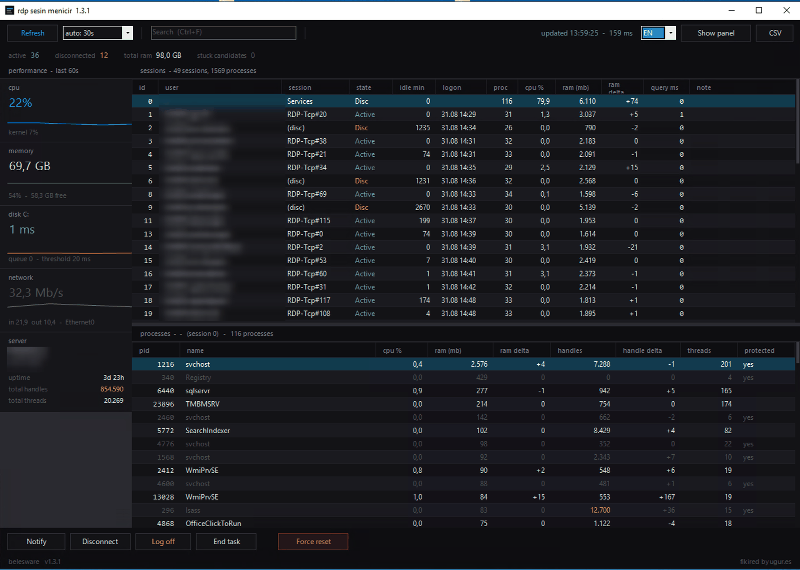

# rdp sesin menicir

A single-file session, process and performance manager for Windows Remote Desktop Session Hosts.

Task Manager freezes on a busy RDSH. This tool does not, because it deliberately avoids every API that causes the freeze. One PowerShell file, no modules, no installer, no dependencies.



## Why not Task Manager

On a session host with 40+ users and 1400+ processes, Task Manager hangs for tens of seconds — and so do Process Explorer and most alternatives. The problem is not the amount of data, it is which APIs get called per process.

This tool never calls any of these:

| API / property | What it does | Why it hangs |
|---|---|---|
| `Responding` | `SendMessageTimeout` to the window | blocks 5s per hung application |
| `MainWindowTitle` | enumerates desktops across sessions | blocks on a broken session |
| `-IncludeUserName` | `OpenProcessToken` per process | one token open per process |
| `Win32_Process` + `GetOwner()` | WMI enumeration | hangs when the WMI provider is sick |
| `Path`, `Company`, `FileVersion` | opens the EXE on disk | disk I/O per process |
| `Modules`, process icons | full DLL list and file reads | the most expensive of all |
| AD / LDAP lookup | resolves the user against a DC | one DC query per session |

What it uses instead:

- **`NtQuerySystemInformation`** — one call returns name, session ID, working set, handle count, thread count **and CPU time** for every process, without opening a single handle. `Get-Process` already calls this internally; .NET just does not surface the CPU field.
- **`WTSEnumerateSessions`** — one call, locale independent. No parsing of `quser.exe` output.
- **`WTSQuerySessionInformation`** — per session, and individually timed (see below).
- **`Win32_PerfFormattedData_*`** — single-instance counters, about 20 ms total.

A full refresh on a 44-session host takes roughly 150 ms.

## Stuck session detection

`WTSQuerySessionInformation` is exactly the call that blocks on a broken session — the same thing that freezes Task Manager. Every session's query is timed separately and the background worker publishes which session it is currently on.

So when enumeration stalls, the tool does not hang with it. It aborts, and tells you **which session ID is responsible**. Sessions slower than one second are flagged in the list before they become a problem.

## Features

- Sessions and their processes, with real CPU %, RAM, handle and thread counts
- **Delta columns** — RAM and handle change since the previous refresh, which is how you catch a handle leak
- Multi-select: notify, disconnect or log off many sessions at once
- Notify, Disconnect, Log off, End task, and Force reset (`rwinsta`) with two-step confirmation
- Left performance panel: CPU, memory, **disk latency** and network, with sparklines
- Server summary: uptime, total handles, total threads
- Protected system processes cannot be terminated
- Every action is written to `RdpSesinMenicir.log` next to the script
- Shadow a session (`mstsc /shadow`), copy user name / session ID / PID
- CSV export, search, sortable columns, dark theme
- English and Turkish interface
- Window layout and preferences remembered between runs

### Why disk latency instead of disk throughput

Task Manager shows MB/s. On a session host that number is almost never the problem — latency is. A C: drive sitting at 20 ms looks perfectly normal on a throughput graph while it quietly destroys logon times.

## Requirements

- Windows Server 2016 / 2019 / 2022 (or Windows 10/11)
- Windows PowerShell 5.1 (ships with Windows)
- 64-bit PowerShell for CPU figures — on 32-bit it falls back to `Get-Process` without CPU
- Administrator rights to manage other users' sessions

## Usage

Double-click **`Run.cmd`**, or right-click it and choose *Run as administrator*.

If you prefer the command line:

```powershell
powershell.exe -NoProfile -ExecutionPolicy Bypass -File .\RdpSesinMenicir.ps1
```

`-ExecutionPolicy Bypass` is a launch parameter. It applies to that process only, writes nothing to the registry and changes no machine setting. You do not need to run `Set-ExecutionPolicy`.

If you start it without elevation it offers to restart as administrator. Decline and it runs anyway, showing **limited rights** in the toolbar. In that mode you can only manage your own session.

### If it will not start

Running `.\RdpSesinMenicir.ps1` directly can fail for two reasons, and `Run.cmd` avoids both.

**"running scripts is disabled on this system"** — the execution policy is `Restricted`, which is the default on Windows 10 and 11. Windows Server defaults to `RemoteSigned`, which is why the same file may run on a server but not on a workstation. Check where the setting comes from with `Get-ExecutionPolicy -List`.

**Downloaded from the internet** — Windows stamps downloaded files with the Mark of the Web, and `RemoteSigned` blocks unsigned scripts carrying it. This is why a file that works when copied locally can fail after being downloaded from GitHub.

`-ExecutionPolicy Bypass` clears both. If you would rather not use it, relax the policy for the current window only and unblock the file:

```powershell
Set-ExecutionPolicy -Scope Process -ExecutionPolicy Bypass
Unblock-File .\RdpSesinMenicir.ps1
```

`-Scope Process` writes nothing to the registry and disappears when you close the window. Do not use `CurrentUser` or `LocalMachine` unless you actually want a permanent change.

For a managed environment, sign the script with a code signing certificate and distribute that certificate to Trusted Publishers via GPO. Then it runs under `AllSigned` with no parameters at all, and any tampering breaks the signature.

### Keyboard

| Key | Action |
|---|---|
| `F5` | Refresh |
| `Ctrl+F` | Focus search |
| `Ctrl+A` | Select all sessions |
| `Del` | End selected process |
| `Esc` | Close |

## Notes

**Antivirus and EDR.** The tool logs users off, terminates processes and calls `ntdll` through P/Invoke. Some endpoint products flag that pattern. It is a plain text PowerShell script — read it before you run it, that is the point of shipping it as one file.

**Notifications.** Messages are sent with `MB_TOPMOST | MB_SETFOREGROUND`, otherwise the box opens behind a full screen application and nobody sees it. A message sent to a disconnected session succeeds but is never seen; the tool warns you before sending.

**Force reset.** `rwinsta` destroys a session at kernel level. It is deliberately limited to one session at a time and requires two confirmations. Use it only when a normal log off does not complete.

## Contributing

Keep the file ASCII-only. PowerShell 5.1 reads a UTF-8 file without a BOM as ANSI and mangles accented characters.

**Bump `$AppVersion` and the `Rds.Sys.Build` constant together.** .NET types cannot be unloaded from a PowerShell session, so a stale build would silently keep running. The tool compares the two and refuses to start rather than run old code — if you change one and not the other, it will tell you.

Test in a fresh PowerShell window. Running twice in the same window is handled, but editing the C# block and re-running is not — open a new window.

## License

MIT — see [LICENSE](LICENSE).

---

## Türkçe

Windows terminal sunucuları (RDS) için tek dosyalık oturum, process ve performans yöneticisi. Bağımlılık yok, kurulum yok, modül yok. Terminal server task manager mağdurları için yapıldı.

**Neden Task Manager değil?** 40+ kullanıcılı bir terminal sunucusunda Task Manager onlarca saniye donuyor. Sebep veri miktarı değil, process başına çağrılan pahalı API'ler: `Responding`, `MainWindowTitle`, `-IncludeUserName`, `Win32_Process`, dosya yolu ve ikon okuma. Bu araç hiçbirini kullanmıyor.

Yerine `NtQuerySystemInformation` tek çağrısıyla bütün process'lerin adını, oturumunu, RAM'ini, handle ve thread sayısını **ve CPU süresini** alıyor. 44 oturumlu bir sunucuda tam yenileme yaklaşık 150 ms sürüyor.

**Takılan oturumu buluyor.** `WTSQuerySessionInformation` takılı bir oturumda bloke olan çağrıdır — Task Manager'ı donduran şey tam olarak budur. Araç her oturumun sorgu süresini ayrı ölçtüğü için, enumerate takıldığında onunla birlikte donmuyor; **hangi oturum ID'sinin sorumlu olduğunu söylüyor.**

**Çalıştırma:** `Run.cmd` dosyasına çift tıkla, ya da sağ tık → Yönetici olarak çalıştır. Komut satırını tercih edersen:

```powershell
powershell.exe -NoProfile -ExecutionPolicy Bypass -File .\RdpSesinMenicir.ps1
```

Buradaki `-ExecutionPolicy Bypass` bir başlatma parametresi, sadece o process için geçerli, makinede hiçbir ayarı değiştirmiyor. `Set-ExecutionPolicy` çalıştırmana gerek yok.

**Açılmıyorsa:** `.ps1` dosyasını doğrudan çağırdığında iki engel çıkabilir. Birincisi execution policy: Windows 10/11'de varsayılan `Restricted`, Windows Server'da `RemoteSigned` — aynı dosyanın sunucuda çalışıp masaüstünde çalışmamasının sebebi budur. İkincisi Mark of the Web: internetten indirilen dosyalar damgalanır ve `RemoteSigned` altında engellenir. `Run.cmd` ikisini de aşar.

Yönetici olarak başlatılmazsa yeniden başlatmayı teklif ediyor; reddedersen çalışmaya devam ediyor ve araç çubuğunda **sinirli yetki** yazıyor.

Arayüz dili sağ üstteki `EN / TR` kutusundan değiştirilir, tercih hatırlanır.
